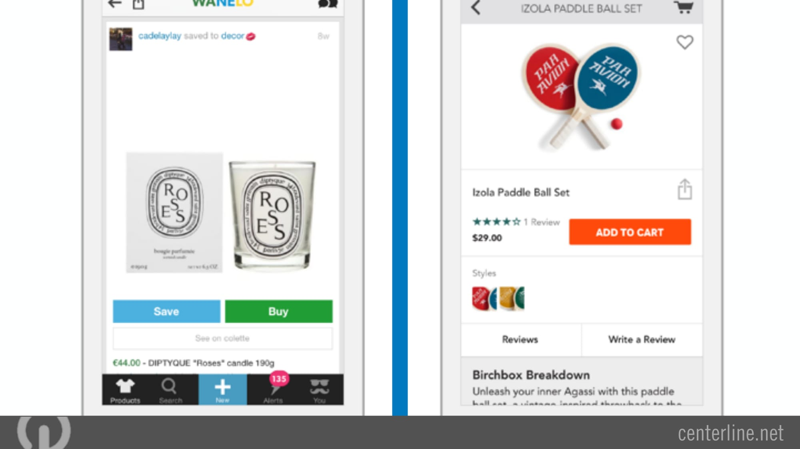
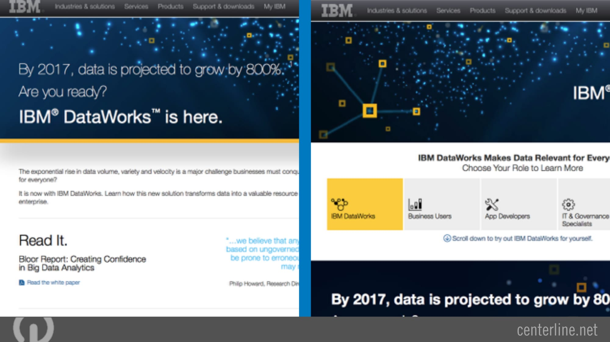

### UX vs. UI
- UI: how the website looks
- UX: how it feels to use the website

### Usability & UX Design
- How a user _feels_ when using the website is key - we want to avoid frustration, and make interaction satisfying, effective and efficient
- We want to create an interface that doesn't make the user think any more than necessary - it should be intuitive
- Could also be framed as complexity vs. simplicity

### Examples

##### Example 1

- Left = BAD
  - Too many options in one big layout
- Right = GOOD
  - Options consolidated into one interaction

##### Example 2

- Left = GOOD
  - Only the most relevant inputs are presented to the user - they're clear and easy to understand
  - An option to alter how the results are displayed is only offered after the search has been made
- Right = BAD
  - Includes inputs not required until after the search has been made
  - Unnecessary questions separating the form into sections

##### Example 3

- Left = BAD
  - Price and product rating not prominent enough
  - Buttons too close together for mobile
  - Tab bar at bottom of screen decreases viewing area
- Right = GOOD
  - Price and product rating are clearly visible, and associated with the action `ADD TO CART`
  - Interface layout is clean - the content dominates the screen
  - Buttons are appropriately spaced for mobile

##### Example 4

- Left = BAD
  - Page content is quite long, and covers a diverse set of page goals
  - No clear next action or direction for the user
- Right = GOOD
  - Only one primary goal / call to action on the page
  - Content is organised in more logical format - clear buttons for each different new page
  
### Quantify your UX

You can embed code in your website from multiple service providers that tracks users on your website.

From this data you can determine:

- Where users enter and exit your website
- What paths they take on your site
- What technology they use
- Where are there errors in your funnels (funneling users to a goal)
- Opportunities for improved flow
- [A/B testing](https://blog.kissmetrics.com/how-to-run-an-ab-test-in-google-analytics/) results

#### Google Analytics UX Setup [Example](https://www.sitepoint.com/5-ways-use-google-analytics-ux-research/)

Google analytics is free for a basic account, and quite robust when set up well. 

